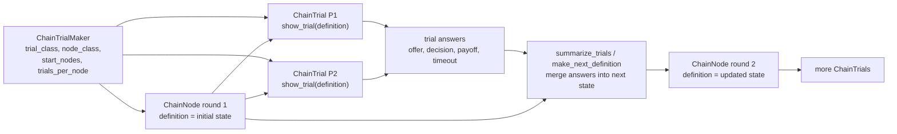

# Chain information flow

Use this reference when explaining or implementing a state-dependent PsyNet
round loop with `ChainNode`, `ChainTrialMaker`, and `ChainTrial`. It is aimed at
experiments such as repeated games, where a completed round produces the state
for the next round.

The running example is an Ultimatum-game style design. A robust chain version
treats each scored round as a node: the node's `definition` stores the state
needed to start that round, each participant's `ChainTrial` records the outcome
of that round, and the node transition derives the next round's definition.

## 1. `ChainNode` owns round state

Prose:

- A `ChainNode` is the database-backed state PsyNet allocates and advances.
- In a one-round-per-node game, one node corresponds to one round.
- Put the durable round-start state in `node.definition`: round index, role
  assignment, cumulative totals, timeout count, history, and any parameters the
  browser needs to render the round.
- The trial answer should contain the completed round result. After the node has
  enough completed and processed trials, PsyNet can summarize those answers and
  create the next node's definition.
- Do not rely only on participant vars or an external live-session table for
  cross-round state if downstream nodes, dashboards, or analyses need to see the
  round sequence.

Pseudocode:

```python
class UltimatumRoundNode(ChainNode):
    def create_initial_seed(self, experiment, participant):
        return {
            "round_index": 1,
            "counted_rounds": 0,
            "totals": {participant_a: 0, participant_b: 0},
            "timeout_count": 0,
            "history": [],
            "roles": draw_roles(participant_a, participant_b),
        }

    def create_definition_from_seed(self, seed, experiment, participant):
        # In simple state machines, the seed already is the next definition.
        return seed

    def summarize_trials(self, trials, experiment, participant):
        completed = [trial for trial in trials if not trial.failed]
        answers = [trial.answer for trial in completed]
        return merge_round_answers_into_next_state(
            previous_definition=self.definition,
            answers=answers,
        )

    def make_next_definition(self, experiment, participant):
        # Preferred current hook. This may delegate to summarize_trials, or the
        # whole next-state calculation can live here directly.
        return self.summarize_trials(
            self.completed_and_processed_trials,
            experiment,
            participant,
        )
```

## 2. `ChainTrialMaker` creates chains, nodes, and trials

Prose:

- A `ChainTrialMaker` owns the allocation policy: which `ChainNode` class to
  use, which `ChainTrial` class to insert, how many starting nodes to create,
  how many trials each node must receive, and how many nodes the chain may grow.
- `start_nodes` creates the first round node(s). Each node starts with a
  `definition`.
- `trials_per_node` says how many completed trials are required before the node
  can advance. In a dyadic Ultimatum round, this might be two participant trials
  for the same node.
- When the required trials are finalized, node transition logic summarizes the
  completed trial answers. In current PsyNet, prefer overriding
  `make_next_definition`; its default implementation calls `summarize_trials`
  to produce a seed and then `create_definition_from_seed`. If
  `create_definition_from_seed` is the identity, `summarize_trials` can be
  written as the method that returns the next round definition.
- The trial maker grows the chain until `max_nodes_per_chain` is reached or the
  experiment's stopping rule is met.

Graph visualization:



Pseudocode:

```python
def get_start_nodes():
    return [
        UltimatumRoundNode(
            definition={
                "round_index": 1,
                "counted_rounds": 0,
                "totals": {"p1": 0, "p2": 0},
                "timeout_count": 0,
                "history": [],
                "roles": {"p1": "proposer", "p2": "responder"},
            }
        )
    ]

UltimatumTrialMaker(
    id_="ultimatum_rounds",
    trial_class=UltimatumRoundTrial,
    node_class=UltimatumRoundNode,
    chain_type="within",       # or "across", depending on sharing
    start_nodes=get_start_nodes,
    trials_per_node=2,         # both members complete the same round node
    max_nodes_per_chain=ROUNDS_REQUIRED,
    expected_trials_per_participant=ROUNDS_REQUIRED,
    max_trials_per_participant=ROUNDS_REQUIRED,
    sync_group_type=GROUP_TYPE, # when dyad members must share allocation
)
```

## 3. `ChainTrial.show_trial` renders one allocated state

Prose:

- `ChainTrial` is the participant-facing unit attached to a node.
- By default, `ChainTrial.make_definition` copies `self.node.definition` into
  `self.definition`, so `show_trial` can read `self.definition` without querying
  or recomputing the round state.
- `show_trial(experiment, participant)` should return the page or joined
  timeline that runs the round: instructions, proposer action, responder action,
  waits, feedback, or a websocket page.
- `show_trial` should not decide which node comes next. It should expose the
  current node state to the browser, collect the response, and save enough
  answer data for `summarize_trials` or `make_next_definition`.
- For live dyadic rounds, synchronization, routes, and websocket messages can
  happen inside the page returned by `show_trial`; the final accepted outcome
  still needs to land in the trial answer.

Pseudocode:

```python
class UltimatumRoundTrial(ChainTrial):
    time_estimate = 30

    def show_trial(self, experiment, participant):
        state = self.definition
        role = state["roles"][str(participant.id)]

        return join(
            InfoPage(render_round_intro(state, role), time_estimate=5),
            UltimatumDecisionPage(
                state=state,
                role=role,
                save_answer="round_result",
                time_estimate=20,
            ),
            InfoPage(render_feedback_placeholder(), time_estimate=5),
        )

    def format_answer(self, raw_answer, **kwargs):
        return {
            "round_index": self.definition["round_index"],
            "participant_id": kwargs["participant"].id,
            "offer": raw_answer.get("offer"),
            "decision": raw_answer.get("decision"),
            "payoff": raw_answer.get("payoff"),
            "timeout": raw_answer.get("timeout", False),
        }
```

Use `psynet-synchronous-experiments/SKILL.md` for dyad formation, barriers, and
`sync_group_type`. Use `psynet-realtime-synchronous-experiments/SKILL.md` when
the page returned by `show_trial` contains websocket coordination.
