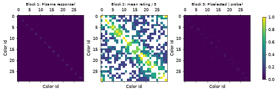

# Report

## Implementation

The attempt implements a self-contained PsyNet experiment in
`code/visual_psychophysics_battery/`. The battery uses three sequential
`StaticTrialMaker` blocks: discrimination, similarity, and identification, each
preceded by its own instruction page. Trial definitions are represented as
`StaticNode` objects with
recorded color ids, conditions, set sizes, array positions, item numbers, and
probe identities.

Stimuli use 30 deterministic colors evenly spaced around the HSV hue circle and
are rendered with PsyNet Graphics. Responses use `KeyboardPushButtonControl`,
supporting both keyboard shortcuts and mouse clicks. Reaction times are derived
from PsyNet's event log as the interval between `responseEnable` and
`pushButtonClicked`. Discrimination trials use a page-level PsyNet event bridge
after the timed fixation, stimulus, and blank period to register the standard
`responseEnable` and `submitEnable` events before enabling native buttons.

## Simulation and analysis

`psynet simulate` was run with 24 bots, producing 720 visual battery trials in
`evidence/simulated_data.zip`. The bot model uses hue-distance-weighted choices
proportional to `exp(-d(x, y))`, as requested. The executed notebook
`evidence/analyses/analysis.ipynb` reads the exported CSV data directly,
summarizes block performance and reaction times, and plots the three empirical
30 x 30 matrices with a shared color bar.

## Participant evidence

The Playwright evidence runner completed one participant flow with 30 clicked
trial responses. It saved a 54-second, 1280 x 720 participant video at
`evidence/participant.mp4`, targeted screenshots under `evidence/screenshots/`,
and a local dashboard snapshot at `evidence/monitor.html`. Video review confirmed
the progress bar is neutral gray, block instructions are ordered, stimuli and
probes are visible, buttons are usable, Block 3 labels are centered, and the
flow reaches completion.

## Validation

- `python experiment.py` passed.
- `psynet test local` passed with 24 bots completing the full 30-trial battery.
- `psynet simulate` completed and exported simulated data.
- `jupyter nbconvert --to notebook --execute --inplace evidence/analyses/analysis.ipynb` passed; the executed notebook is 46 KB.
- `npm run participant-flow` passed, including the assertion that 30 trial responses were clicked.
- `psynet performance-test local --n-bots 40 --duration-minutes 5 --time-factor 1.0 --json-output evidence/performance.json` completed with 0 request errors and 0 bot errors.

## Notes for reviewers

The discrimination response controls are visible during the timed display but
remain disabled until after fixation, the 1000 ms pair display, and the 500 ms
blank interval. The event bridge is intentionally small and uses PsyNet's native
event registration so reaction-time extraction still uses the standard
`responseEnable` event.
